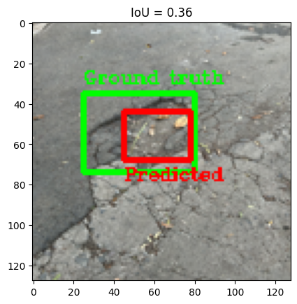

# A program to detect and measure the shape of potholes

Dataset used for training and validation: [Annotated Potholes with Severity Levels](https://www.kaggle.com/datasets/idanbaru/annotated-potholes-with-severity-levels/data).

Validation samples:

The measure of accuracy to the ground truth was the intersection over union (IoU) between the predicted and ground truth bounding box. Setting a threshold of 0.2, with IoUs below this value being declared to have misidentified the pothole in the image.

